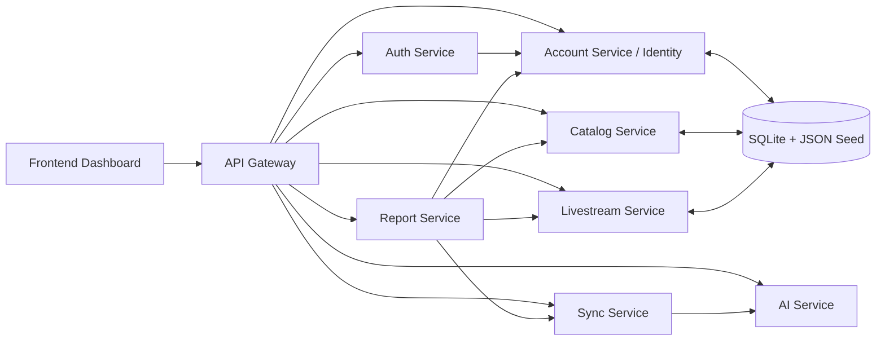

# Smart Livestream Management Platform

Nền tảng quản lý vận hành livestream đa nền tảng theo kiến trúc `Service-Oriented Architecture`, phục vụ các nhu cầu nội bộ như quản lý tài khoản live, nhân sự, sản phẩm, nhà cung cấp, phân tích comment bằng AI và tổng hợp KPI vận hành.

## Tổng quan

## App demo livestream

App demo livestream n?m t?i:

- `apps/demo-app/`

File ch?nh:

- `apps/demo-app/index.html`
- `apps/demo-app/app.js`
- `apps/demo-app/styles.css`

Ch?y nhanh:

```bash
cd apps/demo-app
python -m http.server 3010
```

M? tr?nh duy?t t?i:

- `http://localhost:3010`

Project gồm 4 phần chính:

- `frontend`: app quản lý livestream cho admin, staff và quản lý sản phẩm
- `apps/demo-app`: app demo riêng để mô phỏng phiên live khi không thể trình diễn trực tiếp trên Facebook hoặc TikTok
- `backend`: cụm microservice `FastAPI`
- `ml`: dữ liệu và model phục vụ phân tích comment

Các nghiệp vụ chính đang hỗ trợ:

- Quản lý user nội bộ với các role `admin`, `staff`, `product_manager`
- Quản lý tài khoản livestream theo nền tảng
- Quản lý sản phẩm, nhà cung cấp và offer
- Gán sản phẩm cho từng phòng livestream để staff có dữ liệu giới thiệu khi lên live
- Phân tích comment theo `intent`, `sentiment`, `lead_score`, `priority`
- Gợi ý cân bằng viewer giữa các room livestream
- Đồng bộ comment qua `sync-service`
- Tổng hợp KPI và báo cáo qua `report-service`

## Kiến trúc hệ thống

### Backend services

- `api-gateway`: cổng vào thống nhất cho frontend và client
- `auth-service`: CAPTCHA và đăng nhập
- `account-service`: quản lý identity, user nội bộ và phân quyền
- `catalog-service`: quản lý sản phẩm, nhà cung cấp và offer
- `livestream-service`: quản lý nền tảng, phòng livestream và gán sản phẩm cho room
- `ai-service`: phân tích comment và cân bằng viewer
- `sync-service`: nhận comment, enrich dữ liệu AI, lưu lịch sử sync
- `report-service`: tổng hợp KPI và báo cáo từ các service khác

### Frontend

- Dashboard tĩnh viết bằng `HTML`, `CSS`, `JavaScript`
- Gọi API thông qua `api-gateway`

### AI và dữ liệu

- `account-service`, `catalog-service`, `livestream-service` cùng dùng `SQLite` chung ở giai đoạn hiện tại
- JSON seed được dùng để khởi tạo dữ liệu mẫu
- `ai-service` dùng model `scikit-learn`, có fallback rule-based khi chưa có model

## Công dụng của từng service

### Sơ đồ service



### Danh sách service

- `api-gateway`:
  - Là cổng vào duy nhất của hệ thống cho frontend.
  - Nhận request từ giao diện và chuyển tiếp đến đúng service phía sau.
  - Giúp frontend không phải gọi trực tiếp từng service riêng lẻ.
- `auth-service`:
  - Tạo CAPTCHA cho màn hình đăng nhập.
  - Kiểm tra email, mật khẩu và xác thực người dùng.
  - Trả thông tin user sau khi đăng nhập thành công.
- `account-service`:
  - Quản lý tài khoản nội bộ như `admin`, `staff`, `product_manager`.
  - Lưu thông tin nhân sự, vai trò và mật khẩu đăng nhập.
  - Hỗ trợ tạo mới, đổi mật khẩu và xóa tài khoản nội bộ.
- `catalog-service`:
  - Quản lý danh mục sản phẩm bán trong livestream.
  - Quản lý thông tin nhà cung cấp.
  - Quản lý các offer/bảng giá từ nhà cung cấp cho từng sản phẩm.
  - Hỗ trợ thêm, sửa, xóa sản phẩm và nhà cung cấp.
- `livestream-service`:
  - Quản lý nền tảng livestream như TikTok, Facebook.
  - Quản lý tài khoản/phòng livestream đang vận hành.
  - Quản lý danh sách sản phẩm được gán cho từng room để nhân viên có dữ liệu lên live giới thiệu.
  - Tổng hợp số liệu theo nền tảng như số room, tổng viewers, trạng thái hoạt động.
- `ai-service`:
  - Phân tích nội dung comment của khách hàng.
  - Xác định `intent`, `sentiment`, `lead_score`, `priority`.
  - Hỗ trợ bài toán cân bằng viewer giữa các room livestream.
- `sync-service`:
  - Nhận dữ liệu comment từ các nguồn đồng bộ.
  - Gọi `ai-service` để enrich dữ liệu comment bằng kết quả phân tích.
  - Lưu lịch sử các lần sync và danh sách comment đã xử lý.
- `report-service`:
  - Lấy dữ liệu từ `account-service`, `catalog-service`, `livestream-service`, `sync-service`.
  - Tổng hợp dữ liệu để tạo `database overview`.
  - Sinh KPI tổng quan và báo cáo vận hành cho dashboard quản trị.

### Ghi chú kỹ thuật hiện tại

Ở thời điểm hiện tại, `account-service`, `catalog-service`, `livestream-service` vẫn đang dùng chung:

- dữ liệu seed JSON
- SQLite database

## Công nghệ sử dụng

- Python `3.11`
- FastAPI
- Uvicorn
- Pydantic
- SQLite
- HTML, CSS, JavaScript
- scikit-learn
- pandas
- Docker Compose

## Cấu trúc thư mục

```text
frontend/                               Dashboard tĩnh
apps/
  demo-app/                            App demo riêng cho khách hàng và người bán
backend/
  services/                             Các microservice FastAPI
  docker-compose.yml                    Chạy riêng backend
infra/docker/
  docker-compose.yml                    Chạy toàn bộ hệ thống
ml/                                     Dữ liệu huấn luyện và model AI
docs/                                   Tài liệu hệ thống
```

Ghi chú:

- `frontend/` là app quản lý livestream chính.
- `apps/demo-app/` là app demo mô phỏng khách hàng và người bán cho phần thuyết trình.

Dữ liệu dùng chung cho `identity`, `catalog`, `livestream` được chia theo domain để dễ quản lý:

```text
backend/services/account-service/app/data/
  sqlite/
    account_management.db
  identity/
    users/
  catalog/
    products/
    suppliers/
    supplier_offers/
  livestream/
    platforms/
    accounts/
    product_assignments/
```

## Cách chạy

Project hiện được tối ưu để chạy bằng Docker Compose cho toàn bộ hệ thống:

```bash
cd infra/docker
docker compose up --build
```

Chạy app demo livestream riêng:

```bash
cd apps/demo-app
python -m http.server 3010
```

Các URL public mặc định:

- Frontend: `http://localhost:3000`
- Demo app: `http://localhost:3010`
- API Gateway: `http://localhost:8000`
- AI Service: `http://localhost:8001`
- Auth Service: `http://localhost:8002`
- Account Service: `http://localhost:8003`
- Sync Service: `http://localhost:8004`
- Report Service: `http://localhost:8005`
- Catalog Service: `http://localhost:8006`
- Livestream Service: `http://localhost:8007`

Dừng hệ thống:

```bash
cd infra/docker
docker compose down
```

## Tài khoản mẫu

- Admin: `admin@smartlive.vn` / `123456`
- Staff: `staff@smartlive.vn` / `staff01`
- Product manager: `product.manager@smartlive.vn` / `pm001`

## API chính qua gateway

### Health

- `GET /health`

### Auth

- `GET /api/v1/auth/captcha`
- `POST /api/v1/auth/login`
- `GET /api/v1/auth/me`

### Account và catalog

- `GET /api/v1/users`
- `POST /api/v1/users/managed`
- `POST /api/v1/users/staff`
- `PATCH /api/v1/users/{user_id}/password`
- `DELETE /api/v1/users/{user_id}`
- `GET /api/v1/products`
- `POST /api/v1/products`
- `PATCH /api/v1/products/{product_id}`
- `DELETE /api/v1/products/{product_id}`
- `GET /api/v1/suppliers`
- `POST /api/v1/suppliers`
- `PATCH /api/v1/suppliers/{supplier_id}`
- `DELETE /api/v1/suppliers/{supplier_id}`
- `GET /api/v1/supplier-offers`

### Livestream

- `GET /api/v1/livestream-accounts`
- `GET /api/v1/livestream-accounts/grouped`
- `POST /api/v1/livestream-accounts`
- `DELETE /api/v1/livestream-accounts/{account_id}`
- `GET /api/v1/platform-summaries`
- `GET /api/v1/platforms/{platform}/accounts`
- `GET /api/v1/livestream-product-assignments`
- `POST /api/v1/livestream-product-assignments`
- `DELETE /api/v1/livestream-product-assignments/{assignment_id}`
- `GET /api/v1/database-overview`

### AI

- `POST /api/v1/comments/analyze`
- `POST /api/v1/comments/analyze-batch`
- `POST /api/v1/streams/balance-viewers`
- `POST /api/v1/streams/session-optimizer`

### Sync

- `GET /api/v1/sync/jobs`
- `GET /api/v1/sync/summary`
- `GET /api/v1/sync/records`
- `GET /api/v1/sync/records/export`
- `POST /api/v1/sync/comments`
- `POST /api/v1/sync/comments/batch`

### Reports

- `GET /api/v1/reports/kpis/overview`
- `GET /api/v1/reports/operations`

## Train lại model AI

```bash
pip install -r backend/services/ai-service/requirements.txt
python ml/training/train_comment_models.py
```

Model sau khi train sẽ nằm tại:

- `ml/models/intent_model.joblib`
- `ml/models/sentiment_model.joblib`
- `ml/models/metrics.json`
