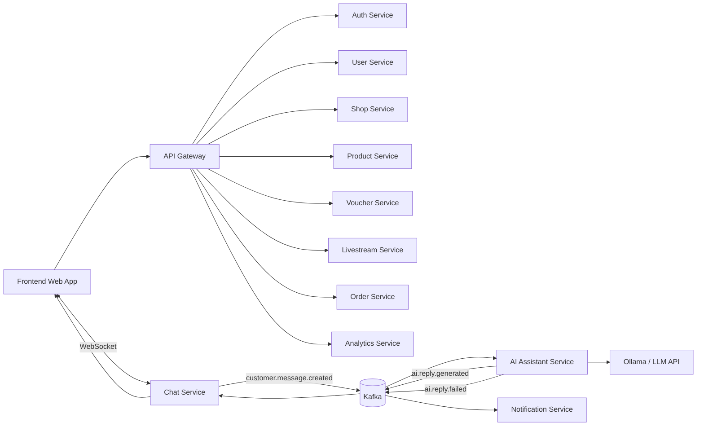
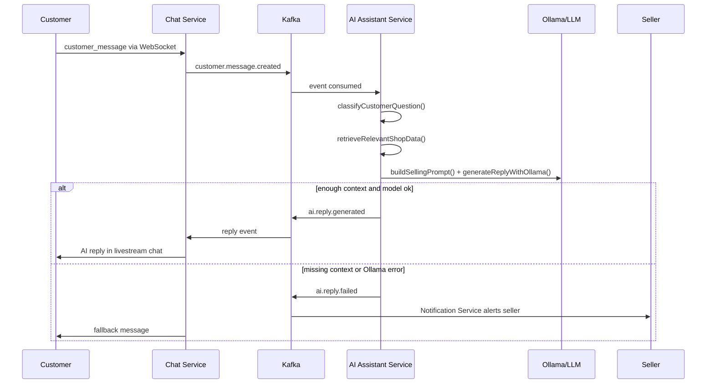

# SmartLive Cloud-Native Livestream Commerce

SmartLive là app livestream bán hàng thông minh theo định hướng **service-oriented architecture** và **cloud-native**. Frontend gọi API Gateway; các năng lực chính được tách thành service độc lập; Chat Service và AI Assistant Service giao tiếp qua event broker để AI tự động trả lời khách hàng trong livestream.

## Architecture



## Services

| Service | Port | Responsibility |
| --- | ---: | --- |
| API Gateway | 8000 | JWT verification, routing, rate limiting, request logging |
| Auth Service | 8010 | Register/login/token verification |
| User Service | 8011 | User profile and role management |
| Shop Service | 8012 | Seller shop information |
| Product Service | 8013 | Products, price, stock, livestream products |
| Voucher Service | 8014 | Voucher management and validation |
| Livestream Service | 8015 | Livestream status, AI toggle, pinned products |
| Chat Service | 8016 | WebSocket chat, chat history, event publishing |
| AI Assistant Service | 8001 | Classify questions, retrieve context, call Ollama/LLM, fallback |
| Order Service | 8017 | Orders and order items |
| Notification Service | 8018 | Seller notifications, AI fallback alerts |
| Analytics Service | 8019 | Viewers, questions, AI replies, orders, revenue |

Every service exposes:

```text
GET /health
GET /ready
```

## Event Flow



Main events:

```text
customer.message.created
ai.reply.generated
ai.reply.failed
order.created
product.stock.updated
livestream.started
livestream.ended
seller.manual.reply.created
```

## AI Assistant

The AI Assistant Service is isolated so the model can be swapped without changing Chat/Product/Voucher services.

Supported engines:

- Local demo: Ollama in Docker
- Cloud GPU VM: Ollama on VM
- Lightweight cloud: OpenAI/Gemini-compatible API adapter

Environment:

```text
OLLAMA_BASE_URL=http://ollama:11434
OLLAMA_MODEL=llama3.1
OLLAMA_TIMEOUT_SECONDS=12
```

Required AI module functions:

```text
classifyCustomerQuestion()
retrieveRelevantShopData()
buildSellingPrompt()
generateReplyWithOllama()
validateAIReply()
saveAIResponseLog()
escalateToSellerIfNeeded()
```

AI never fabricates price, stock, voucher, shipping fee or policies. If context is missing or Ollama fails, it returns:

```text
Thông tin này shop cần kiểm tra thêm, em đã chuyển câu hỏi cho người bán hỗ trợ ạ.
```

## Data And Infrastructure

Local demo uses one PostgreSQL instance, but the schema is split by service intent. For a stricter microservice deployment, create separate databases:

```text
auth_db
product_db
livestream_db
chat_db
order_db
ai_db
```

Infrastructure:

- PostgreSQL + pgvector for relational data and vector-ready product context
- Kafka for event-driven processing
- Redis for cache/session/rate limit
- MinIO as S3-compatible object storage for product images/thumbnails
- Prometheus/Grafana for basic monitoring
- Ollama for local LLM inference

Each backend service has its own `.env.example` file. The local demo uses one PostgreSQL instance, but tables are separated into schemas:

```text
auth_db, user_db, shop_db, product_db, voucher_db,
livestream_db, chat_db, ai_db, order_db, analytics_db
```

RAG support is represented by pgvector columns and `ai_db.knowledge_embeddings`. When product/policy/voucher data changes, the intended flow is to update embeddings in the owning service and let AI Assistant retrieve nearest context before prompting Ollama.

## Run Locally

```bash
docker compose up --build
```

Pull the Ollama model once:

```bash
docker exec -it smartlive-ollama ollama pull llama3.1
```

Open:

```text
Frontend:      http://localhost:3010
API Gateway:   http://localhost:8000/docs
AI Assistant:  http://localhost:8001/docs
Prometheus:    http://localhost:9090
Grafana:       http://localhost:3000
MinIO Console: http://localhost:9001
```

Demo accounts:

```text
CUSTOMER  customer@smartlive.test / 123456
SELLER    seller@smartlive.test / 123456
ADMIN     admin@smartlive.test / 123456
```

## Kubernetes

Manifests are in `infra/k8s`.

```bash
kubectl apply -f infra/k8s/namespace.yaml
kubectl apply -f infra/k8s/configmap.yaml
kubectl apply -f infra/k8s/secret.yaml
kubectl apply -f infra/k8s/kafka.yaml
kubectl apply -f infra/k8s/redis.yaml
kubectl apply -f infra/k8s/postgres.yaml
kubectl apply -f infra/k8s/ollama.yaml
kubectl apply -f infra/k8s/prometheus.yaml
kubectl apply -f infra/k8s/grafana.yaml
kubectl apply -f infra/k8s/domain-services.yaml
kubectl apply -f infra/k8s/workloads.yaml
kubectl apply -f infra/k8s/ingress.yaml
```

For real cloud deployment, build and push images first:

```bash
docker build -t smartlive/api-gateway:latest backend/services/api-gateway
docker build -t smartlive/ai-assistant-service:latest backend/services/ai-service
docker build -t smartlive/chat-service:latest backend/services/chat-service
```

Then replace image names with your registry, for example ECR/GAR/ACR.

## Cloud Options

- AWS: ECS/EKS, RDS, S3, MSK/SQS
- Google Cloud: GKE, Cloud SQL, Cloud Storage, Pub/Sub
- Azure: AKS, Azure Database, Blob Storage, Service Bus
- Simple demo: Docker on VM, Render, Railway, Fly.io

## Cloud-Native Benefits

- Scalability: scale Chat and AI Assistant independently.
- Availability: service replicas and readiness probes.
- Fault isolation: Ollama failure only triggers seller fallback, not app crash.
- Service independence: product/order/chat/AI can evolve separately.
- Event-driven processing: Kafka decouples chat ingestion from AI generation.
- Monitoring/logging: gateway request headers, Prometheus/Grafana, service health endpoints.

## Verification

```bash
node --check apps/demo-app/app.js
python -m compileall backend/services
docker compose config
```

## Checklist Report

- Services checked: API Gateway, Auth, User, Shop, Product, Voucher, Livestream, Chat, AI Assistant, Order, Notification, Analytics.
- Service isolation: each service has its own folder, Dockerfile, requirements, `/health`, `/ready`, and `.env.example`.
- Event flow covered: `customer.message.created`, `ai.reply.generated`, `ai.reply.failed`, `order.created`, `product.stock.updated`, `livestream.started`, `livestream.ended`, `seller.manual.reply.created`.
- AI auto-reply path: implemented through Chat Service event shape, AI Assistant prompt/Ollama pipeline, fallback response, AI logs, and seller fallback UI.
- Docker Compose: validated with `docker compose config`.
- Kubernetes manifests: namespace, configmap, secret, per-service deployments/services, ingress, postgres, redis, kafka, ollama, prometheus, grafana.
- Cleanup: old duplicate README files and old compose files were removed; no legacy API route, debug log, or Ollama typo remains.
