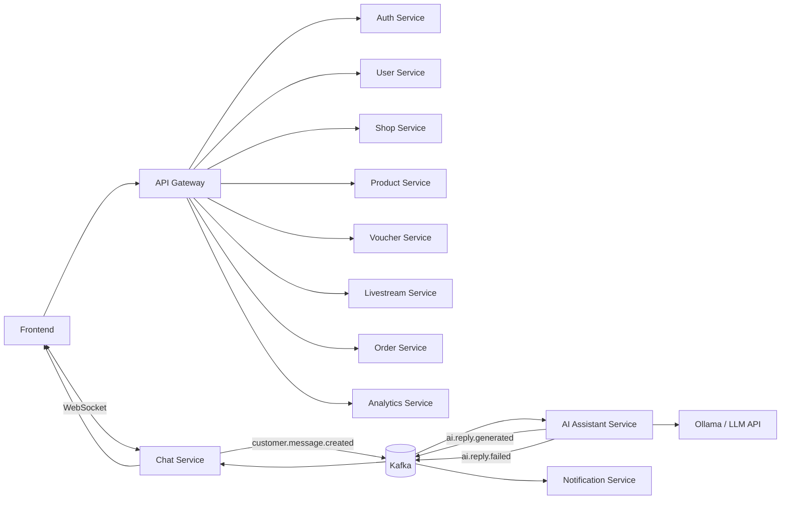
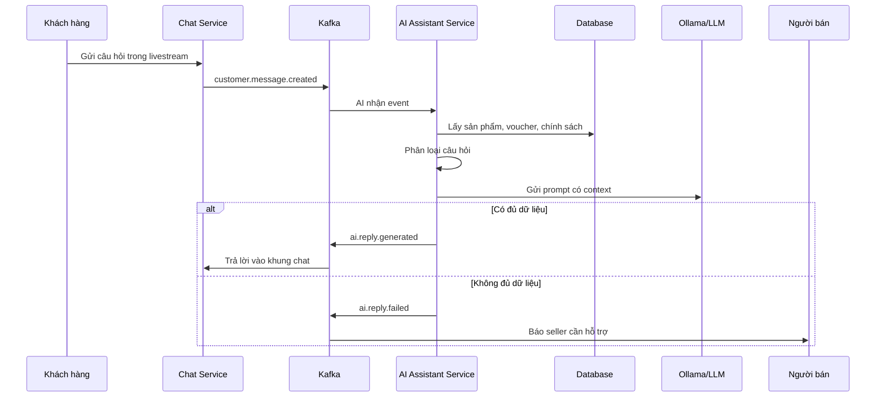

# Báo Cáo Project: SmartLive AI Livestream Commerce

## 1. Giới Thiệu

SmartLive AI Livestream Commerce là hệ thống livestream bán hàng thông minh được xây dựng theo định hướng **Service-Oriented Architecture** và **Cloud-Native**. Hệ thống hỗ trợ người bán tổ chức livestream, quản lý sản phẩm, voucher, đơn hàng và sử dụng AI để tự động trả lời câu hỏi của khách hàng trong khung chat.

Project được thiết kế để có thể chạy demo bằng Docker Compose và có thể mở rộng triển khai trên Kubernetes hoặc các nền tảng cloud như AWS, Google Cloud, Azure, Render, Railway hoặc VM Docker.

## 2. Mục Tiêu Project

Project hướng đến các mục tiêu chính:

- Tách chức năng thành nhiều service độc lập.
- Frontend chỉ gọi qua API Gateway.
- Có xác thực và phân quyền theo role: `CUSTOMER`, `SELLER`, `ADMIN`.
- Chat livestream hỗ trợ realtime bằng WebSocket.
- AI Assistant là service riêng, có thể dùng Ollama hoặc LLM API.
- AI chỉ trả lời dựa trên dữ liệu sản phẩm, voucher và chính sách có trong hệ thống.
- Nếu thiếu dữ liệu, AI trả lời lịch sự và chuyển cho người bán hỗ trợ.
- Hệ thống có Docker Compose, Kubernetes manifests, health check và monitoring cơ bản.

## 3. Công Nghệ Sử Dụng

| Thành phần | Công nghệ |
| --- | --- |
| Frontend | HTML, CSS, JavaScript SPA |
| Backend | Python FastAPI |
| API Gateway | FastAPI |
| Realtime | WebSocket |
| Message Broker | Kafka |
| Database | PostgreSQL, pgvector-ready schema |
| Cache / Rate limit | Redis |
| AI local | Ollama |
| Object Storage | MinIO |
| Monitoring | Prometheus, Grafana |
| Container | Docker, Docker Compose |
| Cloud deploy | Kubernetes manifests |

## 4. Kiến Trúc Tổng Thể



## 5. Danh Sách Service

| Service | Port | Chức năng chính |
| --- | ---: | --- |
| API Gateway | 8000 | Nhận request frontend, xác thực JWT, phân quyền, route API |
| AI Assistant Service | 8001 | Phân loại câu hỏi, truy xuất context, gọi Ollama/LLM, fallback |
| Auth Service | 8010 | Đăng ký, đăng nhập, JWT |
| User Service | 8011 | Quản lý thông tin user và role |
| Shop Service | 8012 | Quản lý shop |
| Product Service | 8013 | Quản lý sản phẩm, giá, tồn kho |
| Voucher Service | 8014 | Quản lý và kiểm tra voucher |
| Livestream Service | 8015 | Quản lý livestream, bật/tắt AI, ghim sản phẩm |
| Chat Service | 8016 | Chat realtime, WebSocket, lưu lịch sử chat |
| Order Service | 8017 | Tạo và quản lý đơn hàng |
| Notification Service | 8018 | Thông báo cho seller khi AI fallback |
| Analytics Service | 8019 | Thống kê viewer, câu hỏi, AI reply, đơn hàng, doanh thu |

Mỗi service đều có endpoint kiểm tra trạng thái:

```text
GET /health
GET /ready
```

## 6. Phân Quyền Giao Diện

Frontend đã tách rõ giao diện theo từng role. Sau khi đăng nhập, hệ thống tự redirect theo role.

| Role | Route mặc định | Chức năng được thấy |
| --- | --- | --- |
| CUSTOMER | `/customer/home` | Xem livestream, xem sản phẩm, chat realtime, thêm giỏ hàng, đặt hàng, xem đơn hàng |
| SELLER | `/seller/dashboard` | Quản lý sản phẩm, voucher, livestream, AI settings, AI logs, fallback, thống kê |
| ADMIN | `/admin/dashboard` | Quản lý user, shop, đơn hàng, AI logs toàn hệ thống, khóa/mở user, đổi role |

Các route chính:

```text
/login
/customer/home
/customer/livestreams
/customer/cart
/customer/orders
/seller/dashboard
/seller/products
/seller/vouchers
/seller/livestreams
/seller/ai-settings
/seller/ai-logs
/seller/fallbacks
/admin/dashboard
/admin/users
/admin/shops
/admin/orders
/admin/ai-logs
```

Nếu người dùng chưa đăng nhập sẽ bị chuyển về `/login`. Nếu đăng nhập sai role và truy cập route không thuộc quyền, hệ thống sẽ chặn và chuyển về dashboard đúng role.

## 7. Luồng AI Trả Lời Khách Hàng



Nguyên tắc của AI:

- Chỉ trả lời dựa trên dữ liệu truy xuất được.
- Không tự bịa giá, tồn kho, mã giảm giá, phí ship hoặc chính sách.
- Nếu không có dữ liệu phù hợp, trả lời:

```text
Thông tin này shop cần kiểm tra thêm, em đã chuyển câu hỏi cho người bán hỗ trợ ạ.
```

## 8. Livestream Thật Bằng WebRTC

Project đã bổ sung livestream thật bằng **WebRTC** và **MediaStream**, không chỉ là giao diện giả.

Luồng sử dụng:

- Người bán vào `/seller/livestreams/00000000-0000-0000-0000-000000004001/studio`.
- Bấm **Bật camera/mic** để trình duyệt xin quyền camera và micro.
- Bấm **Bắt đầu livestream** để phát video/audio.
- Khách hàng vào `/customer/livestreams/00000000-0000-0000-0000-000000004001`.
- Khách hàng xem video/audio realtime và vẫn chat hỏi AI song song.

Các thành phần chính:

- Seller Studio dùng `navigator.mediaDevices.getUserMedia({ video: true, audio: true })`.
- Customer Viewer dùng thẻ `video` nhận remote stream từ WebRTC.
- API Gateway cung cấp WebSocket signaling tại `/ws/signaling/livestreams/{livestream_id}`.
- Chat realtime vẫn dùng WebSocket chat riêng, không trộn logic AI vào WebRTC.

Các signaling event đã hỗ trợ:

```text
join-livestream
seller-ready
viewer-joined
webrtc-offer
webrtc-answer
ice-candidate
livestream-started
livestream-ended
peer-left
```

Cấu hình STUN local:

```text
stun:stun.l.google.com:19302
```

Lưu ý khi deploy cloud:

- WebRTC trên môi trường thật cần HTTPS.
- Nếu người dùng ở mạng NAT phức tạp, nên bổ sung TURN server như coturn.
- Bản demo local dùng STUN là đủ cho kiểm thử trên cùng máy hoặc cùng mạng đơn giản.

## 9. Database Và Hạ Tầng

Project dùng một PostgreSQL local để demo, nhưng dữ liệu được chia schema theo từng service:

```text
auth_db
user_db
shop_db
product_db
voucher_db
livestream_db
chat_db
ai_db
order_db
analytics_db
```

Trong triển khai microservices thật, các schema này có thể tách thành database riêng cho từng service.

Các thành phần hạ tầng local:

- PostgreSQL: lưu dữ liệu nghiệp vụ.
- Kafka: xử lý event giữa Chat Service và AI Assistant Service.
- Redis: cache, session, rate limit.
- MinIO: lưu ảnh sản phẩm hoặc thumbnail.
- Ollama: chạy LLM local.
- Prometheus/Grafana: monitoring cơ bản.

## 10. Hướng Dẫn Chạy Cơ Bản

### 10.1. Yêu Cầu

Máy cần có:

- Docker Desktop
- Docker Compose

### 10.2. Chạy Project

Tại thư mục gốc project, chạy:

```powershell
docker compose up -d --build
```

Kiểm tra container:

```powershell
docker compose ps
```

Mở frontend:

```text
http://localhost:3010
```

API Gateway:

```text
http://localhost:8000/docs
```

### 10.3. Tài Khoản Demo

| Role | Email | Password |
| --- | --- | --- |
| CUSTOMER | `customer@smartlive.test` | `123456` |
| SELLER | `seller@smartlive.test` | `123456` |
| ADMIN | `admin@smartlive.test` | `123456` |

### 10.4. Chạy AI Với Ollama

Ollama đã có trong Docker Compose. Sau khi project chạy, pull model:

```powershell
docker exec -it smartlive-ollama ollama pull llama3.1
```

Xem danh sách model:

```powershell
docker exec -it smartlive-ollama ollama list
```

Xem log AI:

```powershell
docker compose logs -f ai-assistant-service ollama
```

Nếu chưa pull model, AI service vẫn fallback an toàn và không tự bịa dữ liệu.

### 10.5. Dừng Project

Dừng container nhưng giữ dữ liệu:

```powershell
docker compose stop
```

Chạy lại sau khi stop:

```powershell
docker compose start
```

Dừng và xóa container, vẫn giữ volume:

```powershell
docker compose down
```

Xóa sạch cả dữ liệu volume để chạy lại từ đầu:

```powershell
docker compose down -v
```

## 11. Kiểm Thử Cơ Bản

Kiểm tra cú pháp frontend:

```powershell
node --check apps\frontend-app\app.js
```

Kiểm tra cú pháp backend:

```powershell
python -m compileall backend\services
```

Kiểm tra cấu hình Docker Compose:

```powershell
docker compose config --quiet
```

Kiểm tra AI trả lời dựa trên dữ liệu:

```powershell
python scripts\test_ai_questions.py
```

Một số trường hợp đã kiểm thử:

- CUSTOMER đăng nhập được chuyển về `/customer/home`.
- SELLER đăng nhập được chuyển về `/seller/dashboard`.
- ADMIN đăng nhập được chuyển về `/admin/dashboard`.
- CUSTOMER truy cập `/seller/dashboard` bị chặn.
- SELLER truy cập `/admin/dashboard` bị chặn.
- ADMIN truy cập `/seller/products` bị chặn.
- Logout xong không truy cập được protected pages.
- AI trả lời voucher, ship, đổi trả, tồn kho dựa trên database.
- AI fallback khi khách hỏi sản phẩm không có trong hệ thống.

Kiểm thử livestream thật bằng 2 trình duyệt:

1. Mở trình duyệt thứ nhất, đăng nhập SELLER.
2. Vào `/seller/livestreams/00000000-0000-0000-0000-000000004001/studio`.
3. Bấm **Bật camera/mic** và cấp quyền camera, micro cho trình duyệt.
4. Bấm **Bắt đầu livestream**.
5. Mở trình duyệt thứ hai hoặc tab ẩn danh, đăng nhập CUSTOMER.
6. Vào `/customer/livestreams/00000000-0000-0000-0000-000000004001`.
7. Kiểm tra customer thấy video, nghe được âm thanh và gửi chat được.
8. Gửi câu hỏi như `Áo này giá bao nhiêu?` để kiểm tra AI trả lời trong khung chat.

Nếu không thấy camera hoặc micro:

- Kiểm tra quyền camera/micro trong trình duyệt.
- Đóng ứng dụng khác đang chiếm camera.
- Dùng `http://localhost:3010`; localhost được trình duyệt xem là secure context cho `getUserMedia`.
- Khi deploy cloud, bắt buộc dùng HTTPS.

## 12. Kubernetes Và Cloud

Project có Kubernetes manifests trong thư mục:

```text
infra/k8s
```

Các manifest chính:

- Deployment
- Service
- ConfigMap
- Secret
- Ingress
- Kafka
- PostgreSQL
- Redis
- Ollama
- Prometheus
- Grafana

Lệnh triển khai mẫu:

```powershell
kubectl apply -f infra/k8s/namespace.yaml
kubectl apply -f infra/k8s/configmap.yaml
kubectl apply -f infra/k8s/secret.yaml
kubectl apply -f infra/k8s
```

Khi triển khai cloud thật, cần build image, push lên container registry, sau đó thay image trong Kubernetes manifests.

## 13. Lợi Ích Cloud-Native

- **Scalability:** có thể scale riêng Chat Service hoặc AI Assistant Service.
- **Availability:** service có health check và readiness check.
- **Fault isolation:** lỗi Ollama không làm sập toàn bộ hệ thống.
- **Service independence:** mỗi service có trách nhiệm riêng.
- **Event-driven:** Kafka giúp tách luồng chat và xử lý AI.
- **Monitoring:** Prometheus và Grafana hỗ trợ theo dõi hệ thống.

## 14. Kết Luận

SmartLive AI Livestream Commerce là một hệ thống bán hàng livestream được tổ chức theo kiến trúc hướng dịch vụ. Project thể hiện được các thành phần chính của cloud-native application: API Gateway, service độc lập, message broker, database, realtime chat, AI service riêng, Docker, Kubernetes manifests và monitoring cơ bản.

Hệ thống phù hợp để demo quy trình khách hàng hỏi trong livestream, AI truy xuất dữ liệu sản phẩm/voucher/chính sách và trả lời tự động. Khi không đủ dữ liệu, AI chuyển fallback cho người bán, đảm bảo không hallucinate và không đưa thông tin sai cho khách hàng.
