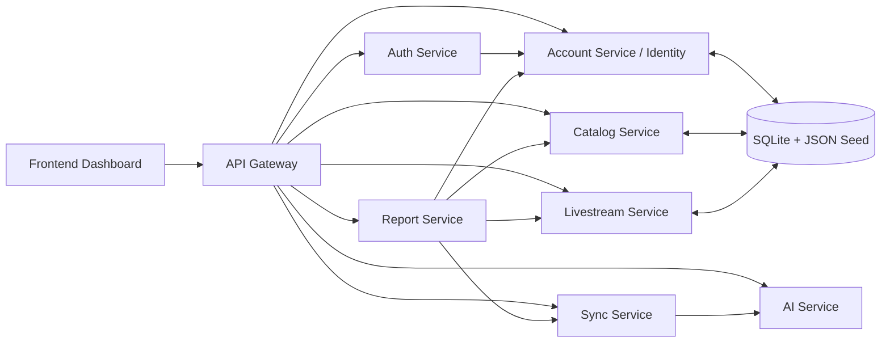

# Smart Livestream Management Platform

Nền tảng quản lý vận hành livestream đa nền tảng theo kiến trúc `Service-Oriented Architecture`, phục vụ các nhu cầu nội bộ như quản lý tài khoản live, nhân sự, sản phẩm, nhà cung cấp, phân tích comment bằng AI và tổng hợp KPI vận hành.

## Tổng quan

Project gồm 3 phần chính:

- `frontend`: dashboard tĩnh cho admin, staff và quản lý sản phẩm
- `backend`: cụm microservice `FastAPI`
- `ml`: dữ liệu và model phục vụ phân tích comment

Các nghiệp vụ chính đang hỗ trợ:

- Quản lý user nội bộ với các role `admin`, `staff`, `product_manager`
- Quản lý tài khoản livestream theo nền tảng
- Quản lý sản phẩm, nhà cung cấp và offer
- Gán sản phẩm cho từng phòng livestream để staff có dữ liệu giới thiệu khi lên live
- Phân tích comment theo `intent`, `sentiment`, `lead_score`, `priority`
- Gợi ý cân bằng viewer giữa các room livestream
- Đồng bộ comment qua `sync-service`
- Tổng hợp KPI và báo cáo qua `report-service`

## Kiến trúc hệ thống

### Backend services

- `api-gateway`: cổng vào thống nhất cho frontend và client
- `auth-service`: CAPTCHA và đăng nhập
- `account-service`: quản lý identity, user nội bộ và phân quyền
- `catalog-service`: quản lý sản phẩm, nhà cung cấp và offer
- `livestream-service`: quản lý nền tảng, phòng livestream và gán sản phẩm cho room
- `ai-service`: phân tích comment và cân bằng viewer
- `sync-service`: nhận comment, enrich dữ liệu AI, lưu lịch sử sync
- `report-service`: tổng hợp KPI và báo cáo từ các service khác

### Frontend

- Dashboard tĩnh viết bằng `HTML`, `CSS`, `JavaScript`
- Gọi API thông qua `api-gateway`

### AI và dữ liệu

- `account-service`, `catalog-service`, `livestream-service` cùng dùng `SQLite` chung ở giai đoạn hiện tại
- JSON seed được dùng để khởi tạo dữ liệu mẫu
- `ai-service` dùng model `scikit-learn`, có fallback rule-based khi chưa có model

## Công dụng của từng service

### Sơ đồ service



### Danh sách service

- `api-gateway`: nhận request từ frontend và chuyển tiếp đến đúng service bên trong hệ thống.
- `auth-service`: tạo CAPTCHA, kiểm tra thông tin đăng nhập và trả thông tin user sau khi xác thực.
- `account-service`: quản lý tài khoản nội bộ, role, thông tin nhân sự và mật khẩu.
- `catalog-service`: quản lý sản phẩm, nhà cung cấp và các offer từ nhà cung cấp.
- `livestream-service`: quản lý nền tảng livestream, tài khoản livestream và danh sách sản phẩm được gán cho từng room.
- `ai-service`: phân tích comment khách hàng, xác định `intent`, `sentiment`, `lead_score`, `priority` và hỗ trợ cân bằng viewer.
- `sync-service`: nhận dữ liệu comment, gọi `ai-service` để enrich dữ liệu và lưu lịch sử đồng bộ.
- `report-service`: tổng hợp dữ liệu từ nhiều service để tạo dashboard tổng quan, KPI và báo cáo vận hành.

### Ghi chú kỹ thuật hiện tại

Ở thời điểm hiện tại, `account-service`, `catalog-service`, `livestream-service` vẫn đang dùng chung:

- dữ liệu seed JSON
- SQLite database

## Công nghệ sử dụng

- Python `3.11`
- FastAPI
- Uvicorn
- Pydantic
- SQLite
- HTML, CSS, JavaScript
- scikit-learn
- pandas
- Docker Compose

## Cấu trúc thư mục

```text
frontend/                               Dashboard tĩnh
backend/
  services/                             Các microservice FastAPI
  docker-compose.yml                    Chạy riêng backend
infra/docker/
  docker-compose.yml                    Chạy toàn bộ hệ thống
ml/                                     Dữ liệu huấn luyện và model AI
docs/                                   Tài liệu hệ thống
databricks/                             Dữ liệu mẫu và notebook hỗ trợ
```

Dữ liệu dùng chung cho `identity`, `catalog`, `livestream` được chia theo domain để dễ quản lý:

```text
backend/services/account-service/app/data/
  sqlite/
    account_management.db
  identity/
    users/
  catalog/
    products/
    suppliers/
    supplier_offers/
  livestream/
    platforms/
    accounts/
    product_assignments/
```

## Cách chạy

Project hiện được tối ưu để chạy bằng Docker Compose cho toàn bộ hệ thống:

```bash
cd infra/docker
docker compose up --build
```

Các URL chính:

- Frontend: `http://localhost:3000`
- API Gateway: `http://localhost:8000`
- AI Service: `http://localhost:8001`
- Auth Service: `http://localhost:8002`
- Account Service: `http://localhost:8003`
- Sync Service: `http://localhost:8004`
- Report Service: `http://localhost:8005`
- Catalog Service: `http://localhost:8006`
- Livestream Service: `http://localhost:8007`

Dừng hệ thống:

```bash
cd infra/docker
docker compose down
```

## Tài khoản mẫu

- Admin: `admin@smartlive.vn` / `123456`
- Staff: `staff@smartlive.vn` / `staff01`
- Product manager: `product.manager@smartlive.vn` / `pm001`

## API chính qua gateway

### Health

- `GET /health`

### Auth

- `GET /api/v1/auth/captcha`
- `POST /api/v1/auth/login`
- `GET /api/v1/auth/me`

### Account và catalog

- `GET /api/v1/users`
- `POST /api/v1/users/managed`
- `POST /api/v1/users/staff`
- `PATCH /api/v1/users/{user_id}/password`
- `DELETE /api/v1/users/{user_id}`
- `GET /api/v1/products`
- `POST /api/v1/products`
- `PATCH /api/v1/products/{product_id}`
- `DELETE /api/v1/products/{product_id}`
- `GET /api/v1/suppliers`
- `POST /api/v1/suppliers`
- `PATCH /api/v1/suppliers/{supplier_id}`
- `DELETE /api/v1/suppliers/{supplier_id}`
- `GET /api/v1/supplier-offers`

### Livestream

- `GET /api/v1/livestream-accounts`
- `GET /api/v1/livestream-accounts/grouped`
- `POST /api/v1/livestream-accounts`
- `DELETE /api/v1/livestream-accounts/{account_id}`
- `GET /api/v1/platform-summaries`
- `GET /api/v1/platforms/{platform}/accounts`
- `GET /api/v1/livestream-product-assignments`
- `POST /api/v1/livestream-product-assignments`
- `DELETE /api/v1/livestream-product-assignments/{assignment_id}`
- `GET /api/v1/database-overview`

### AI

- `POST /api/v1/comments/analyze`
- `POST /api/v1/comments/analyze-batch`
- `POST /api/v1/streams/balance-viewers`
- `POST /api/v1/streams/session-optimizer`

### Sync

- `GET /api/v1/sync/jobs`
- `GET /api/v1/sync/summary`
- `GET /api/v1/sync/records`
- `GET /api/v1/sync/records/export`
- `POST /api/v1/sync/comments`
- `POST /api/v1/sync/comments/batch`

### Reports

- `GET /api/v1/reports/kpis/overview`
- `GET /api/v1/reports/operations`

## Train lại model AI

```bash
pip install -r backend/services/ai-service/requirements.txt
python ml/training/train_comment_models.py
```

Model sau khi train sẽ nằm tại:

- `ml/models/intent_model.joblib`
- `ml/models/sentiment_model.joblib`
- `ml/models/metrics.json`
