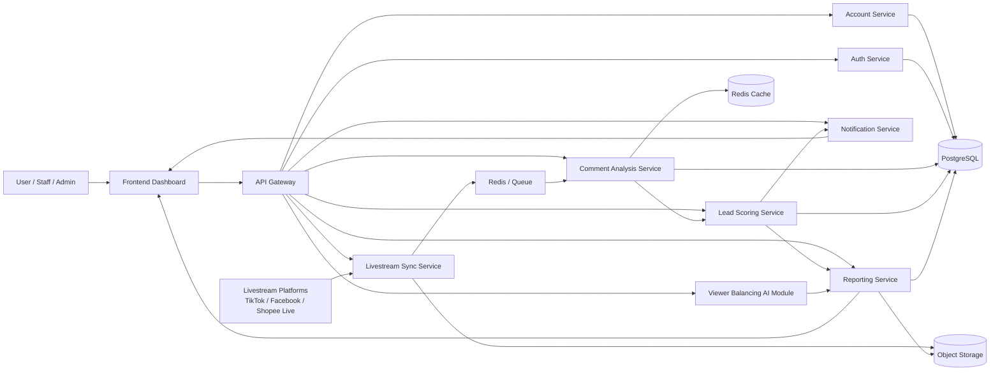
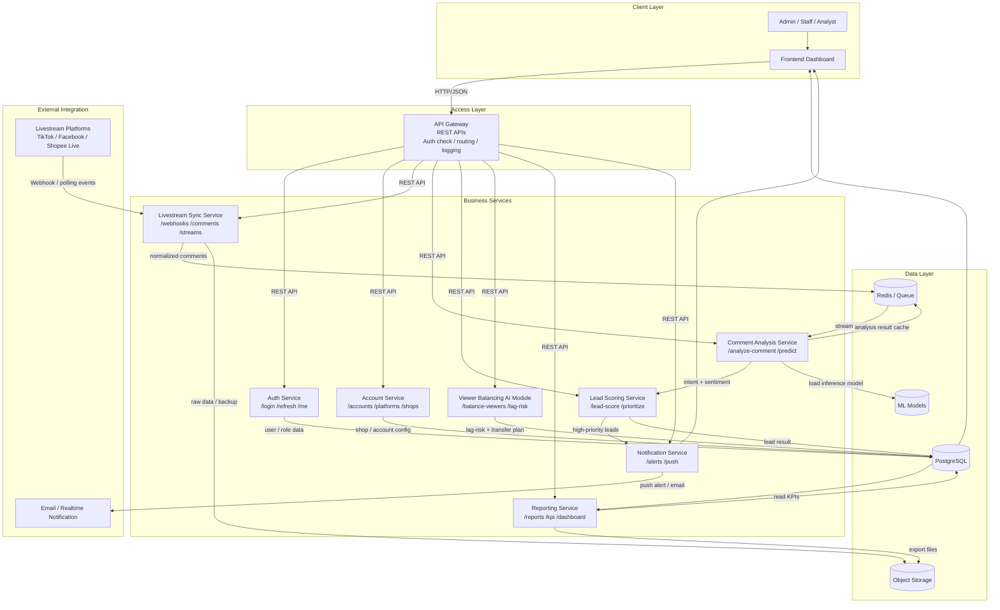

# Kiến trúc hệ thống

## 1. Mô hình tổng thể

Hệ thống được chia thành các thành phần độc lập để dễ mở rộng, bảo trì và triển khai:

- Frontend Dashboard
- API Gateway
- Auth Service
- Account Service
- Livestream Sync Service
- Comment Analysis Service
- Lead Scoring Service
- Viewer Balancing AI Module
- Notification Service
- Reporting Service
- PostgreSQL
- Redis
- Object Storage

## 2. Vai trò từng service

### API Gateway

- Tiếp nhận request từ frontend.
- Xác thực token và định tuyến request đến service phù hợp.
- Có thể bổ sung rate limiting và logging.

### Auth Service

- Đăng ký, đăng nhập, refresh token.
- Quản lý vai trò: admin, staff, analyst.

### Account Service

- Quản lý thông tin shop.
- Quản lý danh sách tài khoản livestream.
- Lưu cấu hình kết nối đến các nền tảng.

### Livestream Sync Service

- Thu nhận comment, sự kiện từ livestream.
- Chuẩn hóa dữ liệu comment về một định dạng thống nhất.
- Đẩy sự kiện sang queue để xử lý tiếp.

### Comment Analysis Service

- Làm sạch comment.
- Phân tích sentiment.
- Nhận diện intent.
- Chuyển kết quả sang service chấm điểm lead.

### Lead Scoring Service

- Tính điểm tiềm năng của khách hàng.
- Ưu tiên lead cho đội ngũ bán hàng.
- Áp dụng rule engine kết hợp AI.

### Viewer Balancing AI Module

- Đánh giá sức tải của từng tài khoản livestream.
- Ước lượng nguy cơ lag dựa trên viewer, capacity và lag signal.
- Đề xuất phân bổ viewer mới vào tài khoản ổn định hơn.
- Hỗ trợ giảm quá tải khi một kênh đang tăng đột biến.

### Notification Service

- Cảnh báo khi có lead điểm cao.
- Gửi thông báo trên dashboard hoặc email.

### Reporting Service

- Tổng hợp KPI livestream.
- Thống kê số comment, số lead, top livestream.

## 3. Luồng dữ liệu đề xuất

1. Tài khoản livestream phát sinh comment.
2. Sync Service thu nhận và chuẩn hóa comment.
3. Comment được đẩy vào Redis/RabbitMQ.
4. AI Service đọc comment và phân tích.
5. Lead Scoring Service chấm điểm.
6. Viewer Balancing Module tính toán phân bổ viewer để tránh lag.
7. Kết quả được lưu vào PostgreSQL.
8. Frontend hiển thị comment và dashboard theo thời gian gần realtime.

## 4. Kiến trúc triển khai

- Frontend: một ứng dụng web.
- Các service backend: deploy độc lập bằng container.
- Database và Redis: sử dụng managed service nếu deploy cloud.
- Monitoring: Prometheus + Grafana hoặc cloud monitoring.

## 5. Sơ đồ logic

```text
Frontend Dashboard
        |
        v
    API Gateway
        |
        +--------------------+
        |                    |
        v                    v
 Auth Service         Account Service
                              |
                              v
                    Livestream Sync Service
                              |
                              v
                       Queue / Redis
                              |
                 +------------+------------+
                 |                         |
                 v                         v
      Comment Analysis Service   Lead Scoring Service
                 |                         |
                 +------------+------------+
                              |
                              v
                  Viewer Balancing AI Module
                              |
                              v
                         PostgreSQL
                              |
                              v
                      Reporting Service
                              |
                              v
                      Frontend Dashboard
```

## 6. Sơ đồ kiến trúc SOA/Microservices



Sơ đồ này thể hiện hệ thống theo hướng kiến trúc dịch vụ, trong đó mỗi service đảm nhận một nghiệp vụ riêng và có thể được triển khai, mở rộng, giám sát độc lập.

## 7. Sơ đồ kiến trúc tổng thể (services, APIs, data flow, integration)



Sơ đồ này nhấn mạnh 4 thành phần chính:

- `services`: các service được tách theo nghiệp vụ riêng.
- `APIs`: frontend và gateway giao tiếp với backend bằng REST API.
- `data flow`: comment đi từ livestream platform qua sync service, vào queue, sang AI, chấm điểm lead, lưu vào database và hiển thị lên dashboard.
- `integration`: hệ thống kết nối với nền tảng livestream bên ngoài, email/thông báo, object storage và model AI.
